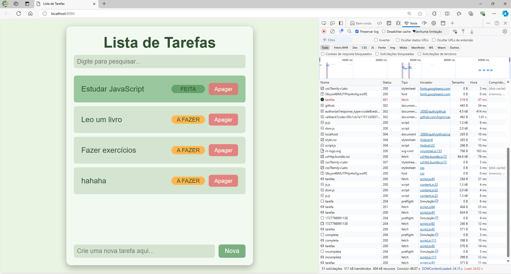

# Lista de Tarefas Simples

Este é um projeto simples de Lista de Tarefas, onde os usuários podem adicionar, marcar como concluídas e apagar tarefas. A aplicação foi originalmente construída para se comunicar com um backend API, mas também está disponível em uma versão que utiliza localStorage para armazenamento local dos dados. 

## Demonstração

Você pode acessar a versão funcional hospedada da aplicação em [lista-de-tarefas-simples.vercel.app](https://lista-de-tarefas-simples.vercel.app/).



## Funcionalidades

- Adicionar nova tarefa
- Marcar uma tarefa como **Feita**
- Apagar uma tarefa
- Filtrar tarefas por texto
- Alternar entre os modos **Claro** e **Escuro** clicando no título

---

## Executar Localmente

Para rodar o projeto localmente, siga os passos:

1. Clone o repositório:
   ```
   git clone https://github.com/sergiocabral/Sample.JavaScript.TodoList.Frontend
   ```

2. Instale as dependências:
   ```
   npm install
   ```

3. Inicie a aplicação:
   ```
   npm start
   ```

O aplicativo será iniciado no navegador em `http://localhost:8080`.

## Backend (opcional)

Originalmente, este projeto se comunicava com uma API RESTful, que pode ser acessada em [github.com/sergiocabral/Sample.JavaScript.TodoList.Backend](https://github.com/sergiocabral/Sample.JavaScript.TodoList.Backend).

Para usar o backend, após o clone do repositório, volte um commit para trás. Dessa forma será usado a API ao invés do localStorage do navegador.

```
git reset --hard HEAD~1
```

Para executar o backend localmente:

1. Clone o repositório backend:
   ```
   git clone https://github.com/sergiocabral/Sample.JavaScript.TodoList.Backend
   ```

2. Instale as dependências:
   ```
   npm install
   ```

3. Inicie o servidor:
   ```
   npm start
   ```

O backend será executado em `http://localhost:3000` e a aplicação frontend irá se comunicar diretamente com ele. As rotas da API estão documentadas na página do GitHub do backend.